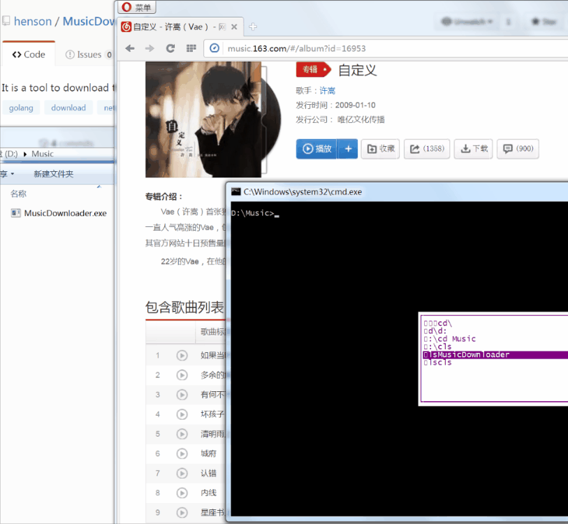

[](https://travis-ci.org/henson/MusicDownloader) [](https://goreportcard.com/report/github.com/henson/MusicDownloader) [](https://github.com/henson/MusicDownloader/releases/tag/v1.0)

# IMPORTANT

网易云音乐的API已改，2017年后入库的音乐不能被本程序解析下载！！！

# MusicDownloader 

It is a tool to download the music files such as .mp3 from netease cloud.



## Overview

- It can download songs, programs, playlists, artists, djradios, and so on.
- Paste the URL address directly in command line, and waiting.

## Installation

```
go get -u github.com/henson/MusicDownloader
```

## Support

- http://music.163.com/#/playlist?id=******
- http://music.163.com/#/song?id=******
- http://music.163.com/#/program?id=******
- http://music.163.com/#/artist?id=******
- http://music.163.com/#/artist/album?id=******
- http://music.163.com/#/album?id=******
- http://music.163.com/#/djradio?id=******


# 网易云音乐一键下载工具

把需要下载的网址粘贴到命令行中即可。

# 支持

目前工具支持直接下载：

- http://music.163.com/#/playlist?id=****** 歌单
- http://music.163.com/#/song?id=****** 单曲
- http://music.163.com/#/program?id=****** 电台节目  
- http://music.163.com/#/artist?id=****** 歌手
- http://music.163.com/#/artist/album?id=****** 歌手专辑
- http://music.163.com/#/album?id=****** 专辑
- http://music.163.com/#/djradio?id=****** 电台专辑
